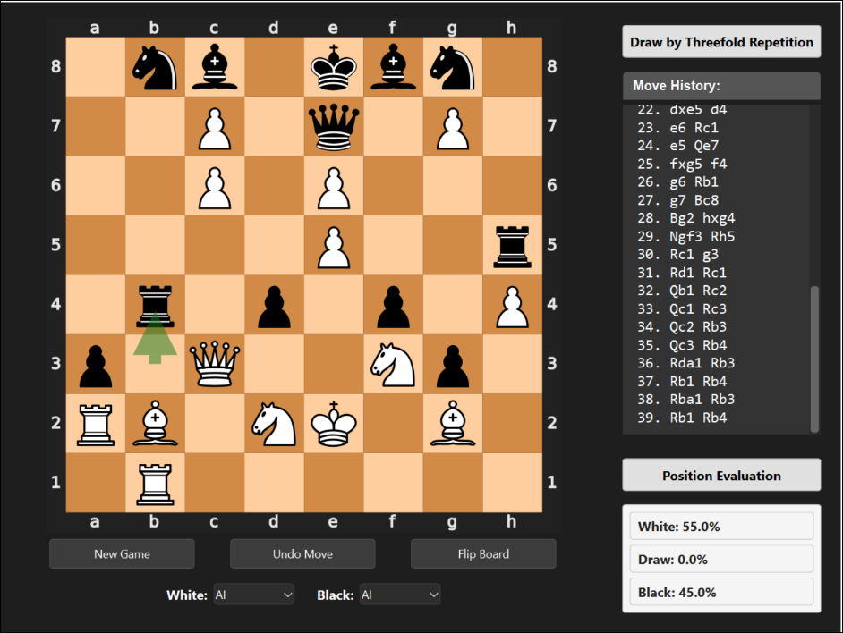

# Attention Chess Bot

# Table of Contents

- [Table of Contents](#table-of-contents)
- [Description](#description)
- [Features](#features)
- [Tech Stack](#tech-stack)

# Description

This chessbot utilizes a Monte Carlo Search Tree & a Large Pytorch Model in order to predict best chess move allowing for theortically high level chess play. With our model we managed to predict GM chess games with up to a 92% accuracy however have yet to be able to play good games of chess. The model utilizes an attention architecture and many different techniques such as residual connections GPU acceleration, Normalized Initilizations and much more to achieve these results.

# Features

- Functional Chess Board
- PvP PvC CvC play
- Strong Game Prediction
- AI Chess Play

# Tech Stack

- Python
- Pytorch
- PyQT
- PyChess
- Pandas

